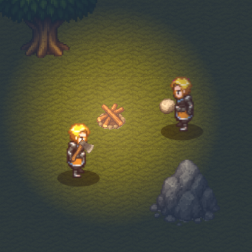

# Vibe Coding Starter Pack: 2D Survival Multiplayer


A lightweight 2D multiplayer survival game starter kit built with modern web technologies. Create interactive survival experiences with persistent player state, real-time multiplayer synchronization, and modular game logic.



## 🗺️ Roadmap

**Completed (✅):**
*   Real-time Multiplayer: Basic player movement synchronization
*   Environment Systems: Day/night cycle
*   Survival Mechanics: Basic resource harvesting (wood/stone/mushrooms)
*   Survival Systems: Health, Hunger, Thirst, Warmth, Death/Respawn
*   Resource Respawning: Trees, Stones
*   World Discovery: Minimap
*   Hotbar/Basic UI: Item selection, basic layout
*   Inventory Management: Moving, swapping, stacking, stack splitting
*   Item Equipping: Tools/Weapons (Hotbar), Armor (Slots)
*   Placeables: Campfire (Basic placement)
*   Consumables: Eating (Mushrooms)

**In Progress (🚧):**
*   Crafting System: Item recipes, crafting stations
*   Campfire Mechanics: Fueling with wood, indefinite burn (while fueled)

**Planned (📓):** 
*   **Core Systems & World:**
    *   Authentication/Account System
    *   World Generation: Procedural generation, biomes, monuments
    *   Terrain Autotiling: Edge detection, Wang tiles, seamless transitions between biomes
    *   Advanced AI: Enemy behaviors, pathfinding
    *   Team/Social Features
*   **Gameplay Loops & Interaction:**
    *   Construction System: Base building (walls, floors, etc.)
    *   Farming System: Planting, growing, harvesting crops
    *   Cooking System: Preparing food using campfire/stations
*   **Combat & Items:**
    *   Combat Improvements: New weapon types (melee, hybrid, ranged), improved hit detection, PvP balancing
    *   Tool/Weapon Durability
    *   More Item Variety: Expanded tools, weapons, armor, resources, consumables

## 🛠️ Tech Stack

| Layer       | Technologies                |
|-------------|----------------------------|
| Frontend    | React 19, Vite 6, TypeScript |
| Multiplayer | SpacetimeDB                |
| Backend     | Rust (WebAssembly)         |
| Development | Node.js 22+                |

## ⚙️ Client Configuration

### Game Parameters (`client/src/config/gameConfig.ts`)

This file centralizes client-side values needed primarily for rendering the game world. 
The server uses its own authoritative values for game logic. Modifying these client values only affects local visuals.

*   `tileSize`: Visual pixel size for grid tiles.
*   `worldWidth`, `worldHeight`: Visual dimensions of the world grid (in tiles).
*   `spriteWidth`, `spriteHeight`: Pixel dimensions of a single sprite frame for rendering.

### SpacetimeDB Connection (`client/src/App.tsx`)

To connect the client to your SpacetimeDB instance, configure the following constants near the top of `client/src/App.tsx`:

```typescript
const SPACETIME_DB_ADDRESS = 'ws://localhost:3000';
const SPACETIME_DB_NAME = 'vibe-survival-game';
```

*   **For Local Development:** Use the default values (`ws://localhost:3000` and your module name).
*   **For Maincloud Deployment:** Replace `SPACETIME_DB_ADDRESS` with your Maincloud WebSocket URI (e.g., `wss://maincloud.spacetimedb.net`) and `SPACETIME_DB_NAME` with your Maincloud database name (e.g., `your-identity/your-database-name`).

## 📁 Project Structure

```
vibe-coding-starter-pack-2d-survival/
├── client/         # React frontend (UI, rendering, input)
│   ├── public/     # Static files (index.html, favicons)
│   ├── src/
│   │   ├── assets/ # Sprites, textures, sounds
│   │   ├── components/ # React components (UI, Canvas)
│   │   ├── generated/  # Auto-generated SpacetimeDB bindings
│   │   ├── hooks/      # Custom React hooks
│   │   └── utils/      # Helper functions (rendering, logic)
│   └── package.json
├── server/         # SpacetimeDB server logic (Rust)
│   ├── src/        # Server code (lib.rs, modules)
│   └── Cargo.toml
├── README.md
└── LICENSE
```

## 🚀 Running the Project Locally

This guide assumes you have installed the prerequisites: Node.js v22+, Rust, and the SpacetimeDB CLI.

1.  **Clone the Repository:**
    ```bash
    git clone https://github.com/SeloSlav/vibe-coding-starter-pack-2d-multiplayer-survival.git
    cd vibe-coding-starter-pack-2d-multiplayer-survival
    ```

2.  **Install Client Dependencies:**
    ```bash
    # From the project root directory
    npm install
    ```

3.  **Start Local SpacetimeDB Server:**
    Open a **separate terminal** window and run:
    ```bash
    spacetime start
    ```
    Keep this terminal running in the background. It hosts your local game database.

4.  **Build, Publish Server Module & Generate Client Bindings:**
    Open **another terminal** window, navigate to the `server` directory, and run these commands:
    ```bash
    cd server
    spacetime publish vibe-survival-game
    spacetime generate --lang typescript --out-dir ../client/src/generated
    ```
    *   **Note:** You need to re-run these two commands *every time* you change the server schema (e.g., modify tables or reducers in `server/src/lib.rs`).

5.  **Run the Client:**
    In the **same terminal** as step 4 (or a new one, just make sure you are in the project root directory `vibe-coding-starter-pack-2d-survival`), run:
    ```bash
    npm run dev
    ```

6.  **Access the Game:**
    Open your browser and navigate to the local address provided by Vite (usually `http://localhost:5173` or similar).

## 🔧 Troubleshooting Local Setup

*   **`Cannot find module './generated'` error in client:**
    *   Ensure you ran `spacetime generate --lang typescript --out-dir ../client/src/generated` from the `server` directory *after* the last `spacetime publish`.
    *   Make sure the `client/src/generated` folder was actually created and contains `.ts` files.
    *   Restart the Vite dev server (`npm run dev`).
*   **Client connects but game doesn't load / players don't appear:**
    *   Check the browser console for errors (e.g., subscription failures).
    *   Check the terminal running `spacetime start` for server-side errors (e.g., reducer panics).
*   **Old players still appearing after disconnect/refresh:**
    *   The disconnect logic might not be removing them correctly. The most reliable way to ensure a clean state is to delete and recreate the local database:
        ```bash
        # Stop spacetime start (Ctrl+C)
        spacetime delete vibe-survival-game # Run from any directory
        spacetime start # Restart the server
        # Then re-publish and re-generate (Step 4 above)
        ```
*   **`spacetime publish` tries to publish to Maincloud instead of local:**
    *   Ensure you are logged out: `spacetime logout`.
    *   Ensure the `spacetime start` server is running *before* you publish.
    *   Check your SpacetimeDB config file (`%LOCALAPPDATA%/SpacetimeDB/config/cli.toml` on Windows, `~/.local/share/spacetime/config/cli.toml` on Linux/macOS) and make sure `default_server` is set to `local` (or comment it out).

## 🔄 Development Workflow

1. **Server Development**:
   - Modify Rust code in the `server/src` directory
   - Run `spacetime build` to compile changes
   - Generate updated TypeScript bindings: `spacetime generate --lang typescript --out-dir ../client/src/generated`

2. **Client Development**:
   - Edit React components in `client/src`
   - The dev server supports hot module replacement

## 🤝 Contributing

We welcome contributions to this project! To contribute, please follow the standard GitHub Fork & Pull Request workflow:

1.  **Fork the Repository**: Click the 'Fork' button on the top right of the main repository page (`SeloSlav/vibe-coding-starter-pack-2d-multiplayer-survival`) to create your personal copy under your GitHub account.
2.  **Clone Your Fork**: Clone *your forked repository* to your local machine:
    ```bash
    git clone https://github.com/YOUR_USERNAME/vibe-coding-starter-pack-2d-multiplayer-survival.git
    cd vibe-coding-starter-pack-2d-multiplayer-survival
    ```
    (Replace `YOUR_USERNAME` with your actual GitHub username).
3.  **Create a Branch**: Create a new branch for your feature or fix:
    ```bash
    git checkout -b feature/your-feature-name
    ```
4.  **Implement Your Changes**: Make your code changes, following project style guidelines.
5.  **Test Thoroughly**: Ensure your changes work as expected and don't break existing functionality.
6.  **Commit Your Changes**: Commit your work with a clear message:
    ```bash
    git commit -m "feat: Add awesome new feature"
    ```
7.  **Push Your Branch**: Push your changes *to your fork*:
    ```bash
    git push origin feature/your-feature-name
    ```
8.  **Open a Pull Request**: Go back to the *original* repository (`SeloSlav/vibe-coding-starter-pack-2d-multiplayer-survival`) on GitHub. You should see a prompt to create a Pull Request from your recently pushed branch. Click it, or navigate to the "Pull Requests" tab and click "New Pull Request".
9.  **Configure the PR**: Ensure the base repository is `SeloSlav/vibe-coding-starter-pack-2d-multiplayer-survival` and the base branch is typically `main` (or the relevant development branch). Ensure the head repository is your fork and the compare branch is your feature branch (`feature/your-feature-name`).
10. **Describe Your Changes**: Provide a clear title and description for your Pull Request, explaining the changes and their purpose.

Whether you're interested in adding new gameplay mechanics, improving existing systems, or enhancing the codebase, your contributions are valuable to making this starter pack even better!

For questions or discussions about potential contributions, feel free to open an issue first to discuss your ideas.

## 📜 License

This project is licensed under the MIT License - see the LICENSE file for details.

---

Created by SeloSlav
